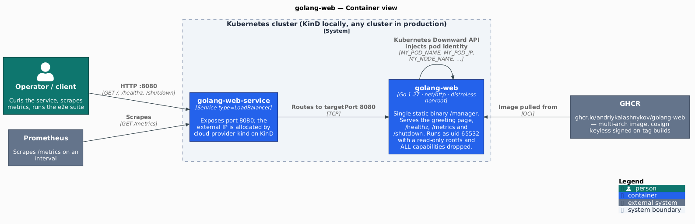

[](https://github.com/AndriyKalashnykov/golang-web/actions/workflows/ci.yml)
[](https://hits.sh/github.com/AndriyKalashnykov/golang-web/)
[](https://opensource.org/licenses/MIT)
[](https://app.renovatebot.com/dashboard#github/AndriyKalashnykov/golang-web)

# HTTP web server with Prometheus metrics in Go

Reference HTTP service in Go for exercising Kubernetes and observability plumbing end to end. The **runtime surface** is a `net/http` server with [prometheus/client_golang](https://github.com/prometheus/client_golang) instrumentation, a Kubernetes-compatible health check, Downward-API pod identity, and a non-root, read-only-rootfs, all-capabilities-dropped pod spec; the **delivery surface** covers a `mise`-pinned toolchain, an eight-gate `static-check` (toolchain alignment, golangci-lint, hadolint, actionlint, gosec, govulncheck, gitleaks, Trivy filesystem + manifest scans), multi-arch images signed with cosign keyless OIDC, and a KinD + cloud-provider-kind end-to-end harness, all Renovate-managed.

| Component | Technology |
|-----------|-----------|
| Language | Go 1.27.1 (pinned in `.mise.toml`, `go.mod`, `Dockerfile`) |
| HTTP | net/http (standard library) |
| Metrics | [prometheus/client_golang](https://github.com/prometheus/client_golang) v1.24.1 |
| Container | Multi-arch images (linux/amd64, linux/arm64); built with **podman or Docker** |
| Orchestration | Kubernetes |
| CI/CD | GitHub Actions, [Renovate](https://docs.renovatebot.com/) |
| Toolchain | [mise](https://mise.jdx.dev/) (all tool versions pinned in `.mise.toml`) |
| Local Kubernetes | KinD + [cloud-provider-kind](https://github.com/kubernetes-sigs/cloud-provider-kind) |
| Code Quality | golangci-lint, gosec, govulncheck, gitleaks, Trivy, hadolint, actionlint, shellcheck |

## Quick Start

```bash
make deps      # install the pinned toolchain (mise)
make build     # build the Go binary
make test      # run tests with coverage
make run       # start the application on port 8080
# Open http://localhost:8080
```

## Prerequisites

Only three things must be installed by hand. Everything else -- Go itself,
every linter, every scanner, KinD, act and Node -- is pinned in
[`.mise.toml`](.mise.toml) and installed by `make deps`.

| Tool | Version | Purpose |
|------|---------|---------|
| [GNU Make](https://www.gnu.org/software/make/) | 3.81+ | Build orchestration |
| [Git](https://git-scm.com/) | 2.0+ | Version control |
| [Podman](https://podman.io/) **or** [Docker](https://www.docker.com/) | latest | Container image builds and local runs. `make deps` installs **podman** if neither is present. |
| [kubectl](https://kubernetes.io/docs/tasks/tools/) | latest | Kubernetes deployment (optional) |

```bash
make deps
```

`make deps` bootstraps [mise](https://mise.jdx.dev/) into `~/.local/bin` if it
is absent (no root required), then installs every pinned tool. It works the
same on **Linux and macOS** (Intel and Apple Silicon) -- mise resolves the
right binary per OS/arch.

It also checks for a container engine and installs **podman** if neither podman
nor Docker is present (`apt`/`dnf`/`pacman`/`zypper` on Linux, Homebrew on
macOS). Podman is the default because it is rootless and needs no daemon;
Docker is equally supported and is used automatically when it is the engine you
already have.

| You want | Run |
|---|---|
| Whatever is installed (**podman preferred**) | `make image-build` |
| Force Docker for one command | `make image-build CONTAINER_ENGINE=docker` |
| Force podman for one command | `make image-build CONTAINER_ENGINE=podman` |
| Force an engine for the whole shell | `export CONTAINER_ENGINE=docker` |
| **See every engine and what it is for** | **`make engines`** |
| See which engine was picked (and install one) | `make deps-engine` |

`make help` prints the three resolved engines at the bottom; `make engines` explains
each one. Only `CONTAINER_ENGINE` is yours to set — the other two are pinned because
kind and plantuml have hard requirements (see the note further down).

**Platform status.** Linux x86_64 is verified end-to-end: both engines build, and a
podman-built image deploys to the docker-based KinD cluster. **macOS is unverified** —
the code paths exist (`brew install podman`, `podman machine init/start`, a Docker
Desktop buildx hint) but have not been exercised. On macOS podman runs in a VM, so
`podman machine start` must be running before any image target; the Makefile prints
that as a note at install time and does not currently check it.
| Log in before pushing an image | `export REGISTRY_TOKEN=<credential>` then `make registry-login` |

`make deps` covers everything needed to **build** an image locally on Linux and
macOS: it installs an engine if none exists and verifies the engine can actually
run `buildx build` (on Debian/Ubuntu, Docker's buildx is a separate
`docker-buildx-plugin` package, so a plain `apt-get install docker.io` produces a
Docker that cannot build this image).

**Pushing needs one thing `make deps` cannot do for you:** a registry credential.

```bash
export REGISTRY_TOKEN=<credential>    # piped on stdin at login, never in argv
make registry-login
make image-push
```

| Variable | Default | Notes |
|---|---|---|
| `IMAGE_REGISTRY` | `ghcr.io` | Any OCI registry — GHCR, Harbor, Docker Hub, ECR, Quay |
| `REGISTRY_USERNAME` | the repo owner | Override for registries where the user differs |
| `REGISTRY_TOKEN` | — | Whatever credential the registry issues |

The credential is whatever `IMAGE_REGISTRY` issues: a GitHub PAT with
`write:packages` for the `ghcr.io` default, a robot account for Harbor, an access
token for Docker Hub. `make registry-login` prints the right guidance for the
registry you have configured. For convenience against the default registry,
`GH_ACCESS_TOKEN` and `CR_PAT` are accepted as fallbacks for `REGISTRY_TOKEN`.

> **KinD needs Docker for its own containers -- but your image is still built by
> whichever engine you chose.** Two different things:
>
> | what | engine | why |
> |---|---|---|
> | the app image | `CONTAINER_ENGINE` (podman by default) | your choice, honoured |
> | kind's nodes, `cloud-provider-kind`, its `kindccm` sidecars | `KIND_ENGINE` (`docker`) | kind runs on the Docker provider here, and the LB controller mounts `/var/run/docker.sock` |
>
> When the two differ, `kind-create` bridges the stores with `<engine> save` +
> `kind load image-archive`, because `kind load docker-image` only reads the
> store of the engine kind is using. So `make e2e` builds with podman and still
> deploys your build -- no override needed. Docker must be installed for kind
> itself; making kind run its *nodes* on podman is a separate thing this repo
> does not do (it needs rootless systemd `Delegate=yes`).

On first run it will ask you to activate mise in your shell:

```bash
echo 'eval "$(mise activate bash)"' >> ~/.bashrc   # or the zsh equivalent
```

The Makefile also puts mise's shim directory on `PATH` for every recipe, so
`make` targets work even without shell activation.

> **Why mise rather than `go install`?** The previous `deps` guarded each tool
> with `command -v <tool> || go install ...`, which short-circuits whenever any
> build of the tool is already on `PATH` -- so the pinned version was never
> actually installed and local tools silently drifted from the pins. `mise
> install` is idempotent and always converges on the pinned version.

Tool versions live in exactly one place:

| Pinned in | What |
|---|---|
| [`.mise.toml`](.mise.toml) | Go, Node, golangci-lint, gosec, gitleaks, actionlint, shellcheck, hadolint, trivy, govulncheck, kind, act |
| `Makefile` | cloud-provider-kind (an image tag) and the Renovate CLI (run via `npx`) |
| `version.txt` | the release version, which `make release` writes and `VERSION` reads |

`make check-toolchain-alignment` (part of `make static-check`) fails the build
if the Go version in `go.mod`, `Dockerfile` and `.mise.toml` ever disagree.

## Architecture

A single statically-linked Go binary (`CGO_ENABLED=0`) in a distroless image, fronted by a
LoadBalancer Service. There is no database, cache, or sidecar — the interesting parts are the
supply chain and the Kubernetes contract, not the topology.

<p align="center"></p>

Source: [`docs/diagrams/c4-container.puml`](docs/diagrams/c4-container.puml) — regenerate with
`make diagrams`; `make diagrams-check` (part of `make static-check`) fails if the committed PNG
has drifted from it.

Locally the LoadBalancer IP is supplied by
[cloud-provider-kind](https://github.com/kubernetes-sigs/cloud-provider-kind), which runs on the
host and allocates from the `kind` Docker network — no in-cluster controller and no address pool to
configure.

## Endpoints

| Path | Method | Purpose |
|------|--------|---------|
| `$APP_CONTEXT` (default `/`) | GET | Greeting page; echoes request headers and the Downward-API pod identity |
| `/healthz` | GET | Liveness/readiness probe — returns `{"health":"ok", "Version":…, "BuildTime":…}` |
| `/metrics` | GET | Prometheus exposition; counter key `request_count_promtotal` |
| `/shutdown` | GET | **Terminates the process immediately** (`os.Exit(0)`). Intended for restart/probe testing — it is unauthenticated, so do not expose it outside a throwaway cluster. |

## Environment Variables

| Variable | Description | Default |
|----------|-------------|---------|
| `PORT` | Listen port | `8080` |
| `APP_CONTEXT` | Base context path | `/` |

### Kubernetes Downward API Variables

| Variable | Description |
|----------|-------------|
| `MY_NODE_NAME` | Name of Kubernetes node |
| `MY_POD_NAME` | Name of Kubernetes pod |
| `MY_POD_NAMESPACE` | Namespace of Kubernetes pod |
| `MY_POD_IP` | Kubernetes pod IP |
| `MY_POD_SERVICE_ACCOUNT` | Service account of Kubernetes pod |

## Container Image

Multi-arch (`linux/amd64`, `linux/arm64`), published to GHCR on tag builds only.

```bash
docker pull ghcr.io/andriykalashnykov/golang-web:latest
```

Every published digest is signed with cosign keyless OIDC (no long-lived key). Verify before running it:

```bash
cosign verify ghcr.io/andriykalashnykov/golang-web:latest \
  --certificate-identity-regexp 'https://github.com/AndriyKalashnykov/golang-web/.github/workflows/ci.yml@refs/tags/v.*' \
  --certificate-oidc-issuer https://token.actions.githubusercontent.com
```

Both flags are required: the identity regexp binds the signature to this repo's workflow, and the issuer confirms the certificate came from GitHub Actions OIDC rather than a leaked key.

## Available Make Targets

Run `make help` to see all available targets.

### Setup

| Target | Description |
|--------|-------------|
| `make help` | List available tasks |
| `make deps` | Install the pinned toolchain via mise (`.mise.toml`) |
| `make deps-engine` | Ensure a container engine is present (installs podman if neither is) |
| `make deps-buildx` | Verify the engine can run `buildx build` |
| `make deps-verify` | Verify every pinned tool is on `PATH` |
| `make check-toolchain-alignment` | Assert the Go version matches across `go.mod`, `Dockerfile` and `.mise.toml` |
| `make diagrams` | Render `docs/diagrams/*.puml` to PNG |
| `make diagrams-check` | Verify the committed diagram PNGs match their `.puml` sources |

### Build & Run

| Target | Description |
|--------|-------------|
| `make build` | Build the Go binary |
| `make run` | Run the application locally |
| `make test` | Run tests with coverage |
| `make format` | Auto-format Go source files |
| `make clean` | Remove Docker image and build artifacts |
| `make update` | Update dependency packages to latest versions |

### Quality & Security

| Target | Description |
|--------|-------------|
| `make static-check` | Run all quality and security checks |
| `make lint` | Run static analysis |
| `make trivy-fs` | Scan filesystem for vulnerabilities, secrets, and misconfigurations |
| `make lint-ci` | Lint GitHub Actions workflows |
| `make sec` | Run security scanner |
| `make vulncheck` | Check for known vulnerabilities in dependencies |
| `make secrets` | Scan for hardcoded secrets |
| `make trivy-config` | Scan K8s manifests for security misconfigurations |
| `make coverage-check` | Verify test coverage meets threshold |

### Docker

| Target | Description |
|--------|-------------|
| `make image-build` | Build Docker image |
| `make image-test-fg` | Run container in foreground with test overrides |
| `make image-test-cli` | Run container with shell entrypoint |
| `make image-run-bg` | Run container in background |
| `make image-cli-bg` | Get shell in running background container |
| `make image-logs` | Tail container logs |
| `make image-stop` | Stop background container |
| `make registry-login` | Log in to the image registry so `image-push` can publish |
| `make image-push` | Build and push the image to the configured registry |

### Kubernetes

| Target | Description |
|--------|-------------|
| `make k8s-apply` | Deploy to Kubernetes cluster |
| `make k8s-delete` | Delete from Kubernetes cluster |
| `make deps-kind` | Verify KinD, kubectl and a KinD-capable engine (Docker) are available |
| `make kind-cloud-provider-start` | Start cloud-provider-kind (supplies LoadBalancer IPs to KinD) |
| `make kind-cloud-provider-stop` | Prune this cluster's `kindccm-*` sidecars (and the controller if unused) |
| `make kind-create` | Create local KinD cluster with cloud-provider-kind LoadBalancer support |
| `make kind-deploy` | Deploy to KinD and wait for rollout **and** a routable LoadBalancer |
| `make kind-undeploy` | Remove application from KinD cluster |
| `make kind-delete` | Delete KinD cluster and prune this cluster's sidecars |
| `make e2e` | Run end-to-end tests against KinD cluster |

LoadBalancer Services in the local cluster are served by
[cloud-provider-kind](https://github.com/kubernetes-sigs/cloud-provider-kind),
which runs on the host, watches the `kind` Docker network and allocates IPs
from its subnet. There is no in-cluster controller and no IP pool to
configure. (This replaced MetalLB, which needs an `IPAddressPool` /
`L2Advertisement` and hits nftables issues on recent `kindest/node` images.)

Two details worth knowing if you run more than one KinD cluster:

- cloud-provider-kind spawns a per-Service Envoy sidecar named `kindccm-*`.
  These **survive `kind delete cluster`** and keep holding IPs in the kind
  subnet, so a later `kind-create` can inherit a stale one and get
  "connection reset by peer". `make kind-delete` prunes them — filtered by
  this cluster's label, so other clusters' sidecars are left alone.
- The controller itself is a host-wide singleton shared by every KinD
  cluster, so it is only stopped once no KinD clusters remain.

### CI

| Target | Description |
|--------|-------------|
| `make ci` | Run full local CI pipeline |
| `make ci-run` | Run GitHub Actions workflow locally using [act](https://github.com/nektos/act) |

### Utilities

| Target | Description |
|--------|-------------|
| `make release` | Create and push a new tag |
| `make version` | Print current version (tag) |
| `make deps-prune` | Remove unused dependencies |
| `make deps-prune-check` | Verify no prunable dependencies (CI gate) |
| `make renovate-bootstrap` | Verify Node (installed via mise) is available for `npx renovate` |
| `make renovate-validate` | Validate Renovate configuration |

## CI/CD

### Workflows

| Workflow | File | Triggers | Purpose |
|----------|------|----------|---------|
| CI | `ci.yml` | push to main, tags `v*`, PRs (paths-ignore for docs/images), `workflow_call` | Lint, test, build, Docker image (tag-only) |
| Cleanup | `cleanup-runs.yml` | Weekly (Sunday midnight), manual, `workflow_call` | Delete old workflow runs, stale caches, and untagged images. **Currently auto-disabled by GitHub** (`disabled_inactivity` — scheduled workflows are suspended after 60 days without repo activity); re-enable with `gh workflow enable cleanup-runs.yml`. |

### CI Jobs

| Job | Runs after | Steps |
|-----|------------|-------|
| **static-check** | — | Go-toolchain alignment, lint (CI + code + Dockerfile), security scan, vulnerability check, secrets scan, filesystem scan (Trivy), K8s manifest scan (Trivy) |
| **build** | static-check | Build Go binary |
| **test** | static-check | Test with coverage |
| **docker** | build + test (tags only) | Multi-arch build, Trivy image scan, push to GHCR, cosign keyless signing |

### Required Secrets

None. The active workflows authenticate with the automatic `GITHUB_TOKEN`; image signing uses cosign keyless OIDC, so there is no signing key to store.

`ANTHROPIC_API_KEY` and `CLAUDE_CONFIG_TOKEN` are set on the repository but are **not consumed by any active workflow** — the two Claude workflows that used them are disabled (see `.github/workflows/*.yml.disabled`). They become required again only if those are re-enabled.

[Renovate](https://docs.renovatebot.com/) keeps dependencies up to date with platform automerge enabled.

## References

- [Docker 101: A Basic Web Server Displaying Hello World](https://ashishb.net/tech/docker-101-a-basic-web-server-displaying-hello-world/)
- [Creating a Simple Web Server with Go](https://tutorialedge.net/golang/creating-simple-web-server-with-golang/)
- [Kubernetes-Ready Service in Go](https://blog.gopheracademy.com/advent-2017/kubernetes-ready-service/)
- [How to Deploy a Go Web Application with Docker](https://semaphoreci.com/community/tutorials/how-to-deploy-a-go-web-application-with-docker)
- [Instrumenting an HTTP Server in Go — Prometheus](https://prometheus.io/docs/tutorials/instrumenting_http_server_in_go/)
