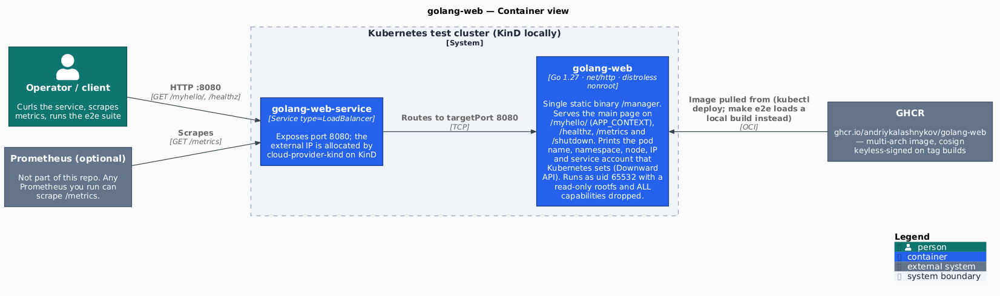

[](https://github.com/AndriyKalashnykov/golang-web/actions/workflows/ci.yml)
[](https://hits.sh/github.com/AndriyKalashnykov/golang-web/)
[](https://opensource.org/licenses/MIT)
[](https://app.renovatebot.com/dashboard#github/AndriyKalashnykov/golang-web)

# HTTP web server with Prometheus metrics in Go

A Go HTTP server with Prometheus metrics, a health endpoint and Kubernetes pod identity,
packaged as a multi-arch image with a KinD end-to-end harness.

| Component | Technology |
|-----------|-----------|
| Language | Go 1.27.1 (pinned in `.mise.toml`, `go.mod`, `Dockerfile`) |
| HTTP | net/http (standard library) |
| Metrics | [prometheus/client_golang](https://github.com/prometheus/client_golang) v1.24.1 |
| Container | Built with podman or Docker; published multi-arch (linux/amd64, linux/arm64) |
| Toolchain | [mise](https://mise.jdx.dev/) (all tool versions pinned in `.mise.toml`) |
| Local Kubernetes | KinD + [cloud-provider-kind](https://github.com/kubernetes-sigs/cloud-provider-kind) |
| CI/CD | GitHub Actions, [Renovate](https://docs.renovatebot.com/) |

## Install the prerequisites

Most tools are installed for you by `make deps`, the first command in
[Run it locally](#run-it-locally). You install only the few below yourself. Run only the
blocks for your system; the Linux blocks are for Ubuntu and Debian.

| Tool | Needed for | Install it in |
|------|------------|---------------|
| [GNU Make](https://www.gnu.org/software/make/), [Git](https://git-scm.com/), [curl](https://curl.se/) | Every section. `make deps` cannot run without them. | [Install make, Git and curl](#install-make-git-and-curl) |
| [Homebrew](https://brew.sh) (macOS only) | Installing podman or Docker on a Mac | [Install Homebrew](#install-homebrew-macos-only) |
| [podman](https://podman.io/) or [Docker](https://docs.docker.com/) | The image sections. The Kubernetes sections and `make ci-run` need Docker. | [Install a container engine](#install-a-container-engine) |
| [kubectl](https://kubernetes.io/docs/reference/kubectl/) | The two Kubernetes sections and step 5 of the push section | [Install kubectl](#install-kubectl) |

To only build, test and run the app, install make, Git and curl and go to
[Run it locally](#run-it-locally).

### Install make, Git and curl

Ubuntu or Debian (curl is not preinstalled on Ubuntu):

```bash
sudo apt-get update && sudo apt-get install -y make git curl
```

Expect the install to end without an error.

macOS already has curl; make and Git come with Apple's command line tools. Skip this command
if you install Homebrew in the next section: its installer adds them.

```bash
xcode-select --install
```

Expect a dialog asking to install the tools, or
`xcode-select: note: Command line tools are already installed` if you have them.

Do not install make with Homebrew: it installs GNU Make under the name `gmake`, so `make`
would still not exist.

### Install Homebrew (macOS only)

Homebrew is the macOS package manager the engine blocks below use. Skip this block if
`brew --version` already works. The installer asks for your password, installs Apple's command
line tools too, and can take several minutes.

```bash
/bin/bash -c "$(curl -fsSL https://raw.githubusercontent.com/Homebrew/install/HEAD/install.sh)"
```

Expect the installer to print `==> Installation successful!` near its end. Then, as its own
block (the installer asks questions, so nothing may be pasted after it), put `brew` on your
`PATH`:

```bash
B=/opt/homebrew/bin/brew; [ -x "$B" ] || B=/usr/local/bin/brew
grep -qs "brew shellenv" ~/.zprofile || echo "eval \"\$($B shellenv)\"" >> ~/.zprofile
eval "$($B shellenv)"
brew --version
```

Expect `Homebrew 4.…` (or newer).

### Install a container engine

The container engine builds and runs the image. Pick one and run only its block.

| You will | Pick |
|---|---|
| Build, run or push the image | podman. Or skip this section: `make deps` installs podman when it finds no engine (on Ubuntu or Debian it runs `sudo apt-get` and asks for your password; on macOS it needs Homebrew). Not on Debian 12: its podman is too old to build the image, so install Docker there. |
| Also use the local Kubernetes cluster (`make e2e`) or `make ci-run` | Docker. KinD needs Docker, even when you build images with podman. Docker builds images too, so it is the only engine you need. |

On arm64 Linux (`uname -m` prints `aarch64`), pick Docker if you will push images: podman 4.x
(Ubuntu 24.04 has 4.9) cannot push the two-architecture image, and `make image-push` refuses
it. podman 5.8 works; 5.4 and 5.7 each pushed it in one test; other 5.x versions are untested.

macOS, podman:

```bash
brew install podman
podman machine inspect >/dev/null 2>&1 || podman machine init
podman info >/dev/null 2>&1 || podman machine start
```

Expect the last lines to say the machine `started successfully`, or nothing if it was already
running.

macOS, Docker, with [Colima](https://github.com/abiosoft/colima), which runs the Docker engine
in a small virtual machine:

```bash
brew install colima docker docker-buildx
mkdir -p ~/.docker/cli-plugins
ln -sfn "$(brew --prefix)/opt/docker-buildx/bin/docker-buildx" ~/.docker/cli-plugins/docker-buildx
colima start
docker context use colima
docker info --format '{{.Name}}: {{.OperatingSystem}}/{{.Architecture}} server={{.ServerVersion}}'
docker buildx version
```

Expect `Current context is now "colima"`, a line like
`colima: Ubuntu 24.04…/aarch64 server=29.…` (`/x86_64` on an Intel Mac), then
`github.com/docker/buildx v0.…`. If Colima was already running, `colima start` prints
`already running, ignoring`, which is fine.

If the line does not start with `colima:`, or a
`Warning: DOCKER_HOST environment variable overrides the active context` appears, a variable in
your shell points `docker` at another engine: run `unset DOCKER_HOST DOCKER_CONTEXT`, then the
block again.

Linux, podman:

```bash
sudo apt-get update && sudo apt-get install -y podman
```

Expect the install to end without an error. podman 4.9 is the oldest version tested (Ubuntu
24.04 has it; Debian 13 has 5.4). Debian 12 has podman 4.3, which does not work: there
`make image-build` stops with `'podman buildx' is not available`. Use Docker on Debian 12 and
on anything older.

Linux, Docker. The first line reads whether you have Ubuntu or Debian:

```bash
D="$(. /etc/os-release && echo "$ID")"
case "$D" in
  ubuntu|debian)
    sudo apt-get update && sudo apt-get install -y ca-certificates curl
    sudo install -m 0755 -d /etc/apt/keyrings
    sudo curl -fsSL "https://download.docker.com/linux/${D}/gpg" -o /etc/apt/keyrings/docker.asc
    sudo chmod a+r /etc/apt/keyrings/docker.asc
    echo "deb [arch=$(dpkg --print-architecture) signed-by=/etc/apt/keyrings/docker.asc] \
https://download.docker.com/linux/${D} $(. /etc/os-release && echo "$VERSION_CODENAME") stable" \
      | sudo tee /etc/apt/sources.list.d/docker.list >/dev/null
    sudo apt-get update
    sudo apt-get install -y docker-ce docker-ce-cli containerd.io docker-buildx-plugin
    sudo usermod -aG docker "$USER"
    ;;
  *) echo "Not Debian or Ubuntu ($D): nothing installed. See https://docs.docker.com/engine/install/" ;;
esac
```

Expect no error. Then log out and back in: until you do, `docker` needs `sudo`. After that,
`docker info` works without `sudo`.

If not:

- `permission denied … docker.sock`: you are still in the old session. Log out fully (or
  restart the machine) and try again.
- `Not Debian or Ubuntu (…): nothing installed` (Linux Mint, Pop!_OS and other derivatives):
  the block changed nothing. Follow [Docker's instructions](https://docs.docker.com/engine/install/)
  for your distribution, or use podman.

On macOS the container engine runs in a virtual machine that must be running before any image
or cluster command. After a restart of the Mac, start it again: `podman machine start` for
podman (run `podman machine init` once before the first start), `colima start` for Docker.

podman is the default: the image commands use it whenever it is installed, and Docker
otherwise; see [Choose podman or Docker](#choose-podman-or-docker).

### Install kubectl

Only for the Kubernetes sections; skip it if `kubectl version --client` already works. This
installs the newest stable kubectl from the official site (dl.k8s.io) into `/usr/local/bin`,
after checking its checksum. Its `sudo` asks for your password.

```bash
V="$(curl -fsSL --connect-timeout 10 https://dl.k8s.io/release/stable.txt)"
case "$(uname -s)" in Linux) K_OS=linux ;; Darwin) K_OS=darwin ;; *) K_OS= ;; esac
case "$(uname -m)" in x86_64|amd64) K_ARCH=amd64 ;; arm64|aarch64) K_ARCH=arm64 ;; *) K_ARCH= ;; esac
U="https://dl.k8s.io/release/${V}/bin/${K_OS}/${K_ARCH}/kubectl"
T="$(mktemp -d)"
if [ -n "$T" ] && [ -n "$V" ] && [ -n "$K_OS" ] && [ -n "$K_ARCH" ] \
   && curl -fsSL --connect-timeout 10 --retry 3 -o "$T/kubectl" "$U" \
   && H="$(curl -fsSL --connect-timeout 10 --retry 3 "${U}.sha256")" && [ -n "$H" ] \
   && [ "$( (sha256sum "$T/kubectl" 2>/dev/null || shasum -a 256 "$T/kubectl") | awk '{print $1}')" = "$H" ] \
   && sudo install -d /usr/local/bin && sudo install -m 0755 "$T/kubectl" /usr/local/bin/kubectl; then
  rm -rf "$T"
  /usr/local/bin/kubectl version --client
  [ "$(command -v kubectl)" = /usr/local/bin/kubectl ] \
    || echo "WARNING: 'kubectl' on your PATH is '$(command -v kubectl || echo not found)', not /usr/local/bin/kubectl"
else
  rm -rf "$T"
  echo "kubectl NOT installed: dl.k8s.io unreachable, unsupported machine, checksum mismatch, or sudo failed (${U})"
fi
```

Expect `Client Version: v1.…` (and a `Kustomize Version` line), and no `WARNING` line.

If not:

- `kubectl NOT installed`: nothing changed. Read the `curl:` or `sudo:` error above it. If
  this machine cannot reach dl.k8s.io, follow Kubernetes' instructions for
  [Linux](https://kubernetes.io/docs/tasks/tools/install-kubectl-linux/) or
  [macOS](https://kubernetes.io/docs/tasks/tools/install-kubectl-macos/).
- `WARNING: 'kubectl' on your PATH is …`: another kubectl is found first, or (`not found`)
  `/usr/local/bin` is not in your `PATH`. Put `/usr/local/bin` first in your `PATH`, or keep
  using the other kubectl.

### Check the tools

This lists what is still missing and prints the versions of the rest.

```bash
for t in make git curl; do
  command -v "$t" >/dev/null 2>&1 || echo "MISSING: $t"
done
command -v podman >/dev/null 2>&1 && podman --version
command -v docker >/dev/null 2>&1 && docker --version
command -v kubectl >/dev/null 2>&1 && kubectl version --client
```

Expect no `MISSING` line, then a version line for each engine you installed and, if you
installed it, kubectl's `Client Version:`. No engine line is fine when you left podman to
`make deps`.

### What `make deps` installs for you

You do not install these. `make deps` does, into your home directory, and it is safe to run
again at any time:

| Tool | Notes |
|------|-------|
| [mise](https://mise.jdx.dev/) | Goes into `~/.local/bin`. It installs the rest of this table. |
| Go, the linters and scanners, kind | The versions pinned in [`.mise.toml`](.mise.toml) |
| [Podman](https://podman.io/) | Only when neither podman nor Docker is installed; see [Install a container engine](#install-a-container-engine). |

`make deps` does not install Docker or kubectl.

## Run it locally

Needs make, git and curl; see [Install make, Git and curl](#install-make-git-and-curl).

```bash
git clone https://github.com/AndriyKalashnykov/golang-web.git
cd golang-web
make deps
make build
make test
make run
```

| Command | What it does |
|---|---|
| `make deps` | Installs the tools listed in [What `make deps` installs for you](#what-make-deps-installs-for-you). The first run downloads them; later runs print one line. |
| `make build` | Builds the Go binary `manager`. |
| `make test` | Runs the tests with coverage. |
| `make run` | Starts the app on port 8080 and keeps running. |

Expect `make run` to end with these lines (each after a timestamp) and stay in the foreground:

```text
Starting web server on port 8080
Open http://localhost:8080/
```

Open <http://localhost:8080>; [Endpoints](#endpoints) shows the page. Press Ctrl-C to stop the
app; the `make: *** … Error` line it leaves is normal. If port 8080 is taken, use another:
`make run APP_PORT=9090`.

`make help` lists every target.

### Use the pinned tools at your own prompt

Optional, and only after `make deps` has run: the `make` commands find the pinned tools by
themselves. To also use them (`go`, `kind` and the rest) at your own prompt, run the line for
your shell once, then open a new terminal.

zsh (the macOS default):

```bash
echo 'eval "$(~/.local/bin/mise activate zsh)"' >> ~/.zshrc
```

bash:

```bash
echo 'eval "$(~/.local/bin/mise activate bash)"' >> ~/.bashrc
```

Expect `go version` in the repo directory to print `go1.27.1`.

## Change settings

Optional: every setting has a default. To change a setting once, put it on the command line,
as in `make run APP_PORT=9090 MESSAGE_TO=You`. To change settings for every `make` command,
copy the example file, then uncomment and edit the lines you want in `.env`:

```bash
cp .env.example .env
```

[`.env.example`](.env.example) lists every setting with its default. When a setting is given
in more than one place, the order is: command line, then a variable exported in your terminal
(even an empty one), then `.env`, then the default.

## Run the published image

A multi-arch image (`linux/amd64`, `linux/arm64`) is published to GitHub's registry on every
release. Its tags have no `v`: `0.0.4`, `0.0`, `0` and `latest`.

Pull it and run it; with Docker, replace `podman` with `docker`:

```bash
podman pull ghcr.io/andriykalashnykov/golang-web:latest
podman run --rm -p 127.0.0.1:8080:8080 ghcr.io/andriykalashnykov/golang-web:latest
```

`127.0.0.1` keeps the port to this machine: the 0.0.4 image serves `/shutdown`, which stops
the app for anyone who can reach it.

Expect the log line `Starting web server on port 8080`. Open <http://localhost:8080>. Press
Ctrl-C to stop it. If port 8080 is taken, change the first `8080`, as in `-p 127.0.0.1:9090:8080`.

## Build and run the image locally

Build the image from this checkout and run it in the background:

```bash
make image-run-bg
```

Expect this last line:

```text
golang-web running: http://localhost:8080/   logs: make image-logs   stop: make image-stop
```

The image is named `ghcr.io/andriykalashnykov/golang-web:v0.0.4`. That is only a local name;
nothing is uploaded.

| Command | What it does |
|---|---|
| `make image-build` | Builds the image without running it |
| `make image-run-bg` | Builds the image and runs it in the background on port 8080 (`APP_PORT=9090` to change) |
| `make image-logs` | Follows the container's log; Ctrl-C to leave (the `make: ***` line it prints then is normal) |
| `make image-stop` | Stops the container; expect `Stopped golang-web.` |

### Choose podman or Docker

podman is the default: the image commands use it whenever it is installed. With only Docker
installed they use Docker, and there is nothing to set.

| You want | Do this |
|---|---|
| podman (the default) | Nothing |
| Docker, when podman is also installed, for one command | Add `CONTAINER_ENGINE=docker` to it, as in `make engines CONTAINER_ENGINE=docker` |
| Docker, when podman is also installed, for every command in this terminal | `export CONTAINER_ENGINE=docker` |
| See which engine is used | `make engines` |

## Test it on a local Kubernetes cluster

Needs Docker and kubectl; see [Install the prerequisites](#install-the-prerequisites). You do
not install KinD: the `make` commands in this section install the version pinned in
[`.mise.toml`](.mise.toml) and find it themselves, without `kind` on your `PATH`. Stop
anything that uses port 8080 first; on macOS the cluster publishes the app there.

```bash
make e2e
```

This builds the image, creates a [KinD](https://kind.sigs.k8s.io/) cluster named `golang-web`,
points kubectl at it (context `kind-golang-web`), deploys the app into the `default` namespace
and runs five checks against it. Expect near the end (your address differs):

```text
Service reachable at http://172.18.0.4:8080/myhello/
...
=== Results: 5 passed, 0 failed ===
```

Open the printed address. The cluster keeps running until you delete it; the next section can
use it. To delete it:

```bash
make kind-delete
```

Expect `KinD cluster 'golang-web' deleted.`

## Deploy the published image to a cluster

Needs kubectl and a test cluster; the one `make e2e` created works. The image deployed is the
published `ghcr.io/andriykalashnykov/golang-web:0.0.4`, not one you built.

Do not use a cluster that others can reach: the 0.0.4 image always serves `/shutdown`, so
anyone who can open the app's address can stop it. The first release after 0.0.4 will serve
it only with `ENABLE_SHUTDOWN=true`.

Check which cluster kubectl points at:

```bash
kubectl config current-context
```

Expect the name of your test cluster (`kind-golang-web` for the local one). If it prints
`current-context is not set`, there is no cluster; create the local one with `make e2e`.

Run the rest of this section in one terminal, from the repo directory; the blocks share the
`NS` variable.

Deploy [`k8s/golang-web.yaml`](k8s/golang-web.yaml), a Deployment and a LoadBalancer Service,
into its own namespace:

```bash
NS=golang-web-demo
kubectl create namespace "$NS" --dry-run=client -o yaml | kubectl apply -f -
kubectl apply -n "$NS" -f k8s/golang-web.yaml
kubectl rollout status -n "$NS" deployment/golang-web --timeout=120s
```

Expect `deployment "golang-web" successfully rolled out`.

Open it through a port-forward. The page is served under `/myhello/` (the manifest sets
`APP_CONTEXT`); `/` returns 404.

```bash
kubectl port-forward -n "$NS" svc/golang-web-service 18080:8080 >/dev/null & PF=$!
curl -sS --retry 10 --retry-connrefused --retry-delay 1 http://localhost:18080/myhello/
kill "$PF"
```

Expect `Hello, World` and the line `MY_POD_NAMESPACE: golang-web-demo`. Also normal: a job
number after the first line, one `curl: (7) Failed to connect` line before the page, and in
zsh a `terminated` line at the end.

Optional, and only where the cluster gives the Service an IP address your machine can reach:
the local cluster on Linux, or a cloud cluster that publishes an IP. Skip it on macOS with the
local cluster.

```bash
kubectl wait -n "$NS" svc/golang-web-service --for=jsonpath='{.status.loadBalancer.ingress[0].ip}' --timeout=120s \
  && IP=$(kubectl get svc -n "$NS" golang-web-service -o jsonpath='{.status.loadBalancer.ingress[0].ip}') \
  && curl -sS --retry 5 --retry-all-errors "http://$IP:8080/myhello/"
```

Expect the same page. If the first command prints `timed out waiting for the condition`, the
cluster has no LoadBalancer controller or publishes a hostname instead of an IP: run
`kubectl get svc -n "$NS" golang-web-service` and read the EXTERNAL-IP column.

Remove everything this section created. On macOS with the local cluster, skip this command and
run `make kind-delete` instead: there the cluster can publish only one LoadBalancer Service on
port 8080, so this Service never gets its address and the delete waits forever.

```bash
kubectl delete namespace "$NS"
```

Expect `namespace "golang-web-demo" deleted`.

## Push your own image to a registry

Optional: only to publish your own build. A ready-made image is already published; see
[Run the published image](#run-the-published-image).

The image is pushed as `<registry>/<owner>/golang-web:<version>`:

| Part | What it is | Default |
|---|---|---|
| `<registry>` | The registry host. Variable: `IMAGE_REGISTRY`. | `ghcr.io` (GitHub's registry) |
| `<owner>` | Your account on that registry. On ghcr.io: your GitHub user or organization name, in lowercase. Variable: `OWNER`. | `andriykalashnykov` (the author; you cannot push there) |
| `<version>` | The contents of `version.txt`. | `v0.0.4` |

### 1. Create a token the registry accepts

For ghcr.io, create a personal access token (classic) with only the `write:packages` scope at
[github.com/settings/tokens/new?scopes=write:packages](https://github.com/settings/tokens/new?scopes=write:packages)
and copy it. Fine-grained tokens do not work with ghcr.io. For another registry, use the
password or token it issues.

### 2. Set your owner name and the token

Run this line alone, then paste the token and press Enter. Nothing is shown while you paste.

```bash
read -rs REGISTRY_TOKEN && export REGISTRY_TOKEN
```

Then set your owner name and check it. Replace `octocat` with your GitHub user or organization
name, in lowercase:

```bash
export OWNER=octocat
make help | grep Image
```

For a registry other than ghcr.io, also run `export IMAGE_REGISTRY=registry.example.com` with
your registry's host and, when your login name is not the owner name,
`export REGISTRY_USERNAME=your-login`.

Expect your owner name in the image (the version is whatever `version.txt` holds):

```text
Image (image-push target)    - ghcr.io/octocat/golang-web:v0.0.4  <- set OWNER / IMAGE_REGISTRY for your own
```

### 3. Log in

```bash
make registry-login
```

Expect `Login Succeeded`. If not: `ERROR: no credential` means `REGISTRY_TOKEN` is empty in
this shell, so repeat step 2. `denied`, `unauthorized` or `403 Forbidden` means the token was
mistyped, has expired, or is not a classic token, so repeat steps 1 and 2.

### 4. Build and push

```bash
make image-push
```

This builds the image for `linux/amd64` and `linux/arm64` and pushes both as one tag. It builds
from source; it does not push an image `make image-build` made. Expect these two lines first,
and no `Push to ... failed.` at the end:

```text
podman buildx is available.
Building ghcr.io/octocat/golang-web:v0.0.4 for linux/amd64,linux/arm64
```

(`docker buildx is available.` when the engine is Docker.)

The image then appears under **Packages** on your GitHub profile, or on the organization's
page when `OWNER` is an organization. A new ghcr.io package is private until you change its
visibility there.

If it stops:

| Message | Do this |
|---|---|
| `Push to ... failed.` | Check `OWNER` is yours (step 2), that the token has `write:packages` (step 1), and that you logged in with the same engine you push with (step 3). |
| `This Docker uses the classic image store` | Follow the printed instructions to turn on the containerd image store, or push one platform: `make image-push PUSH_PLATFORMS=linux/amd64`. |
| `podman older than 5 is refused` (arm64 Linux with podman 4.x) | Use Docker for both steps: `make registry-login CONTAINER_ENGINE=docker`, then `make image-push CONTAINER_ENGINE=docker`. Or upgrade to podman 5.8. |
| `'podman buildx' is not available` (podman older than 4.9, such as Debian 12's 4.3) | Use Docker for both steps: `make registry-login CONTAINER_ENGINE=docker`, then `make image-push CONTAINER_ENGINE=docker`. |

### 5. Deploy the image you pushed

Optional. Needs kubectl pointed at a test cluster that can pull the image; on ghcr.io, make
the package public first. `make k8s-apply` deploys into kubectl's current context and current
namespace, and prints both before it changes anything. Run it in the same terminal, so `OWNER`
is still set:

```bash
make k8s-apply
kubectl rollout status deployment/golang-web --timeout=180s
```

Expect (your image, context and namespace differ; `configured` replaces `created` when the app
is already in that namespace, as it is in the local cluster after `make e2e`):

```text
Deploying ghcr.io/octocat/golang-web:v0.0.4 to context 'kind-golang-web', namespace 'default'.
deployment.apps/golang-web created
service/golang-web-service created
deployment "golang-web" successfully rolled out
```

If the rollout times out and `kubectl get pods` shows `ImagePullBackOff`, the cluster cannot
pull the image: check the package is public and that `OWNER` is the one you pushed with.

Reach the app with the port-forward block in
[Deploy the published image to a cluster](#deploy-the-published-image-to-a-cluster), leaving
out `-n "$NS"`. Remove the app:

```bash
make k8s-delete
```

Expect `Deleting golang-web from context ...` and two `deleted` lines.

When you are done, remove the token from this terminal with `unset REGISTRY_TOKEN`.

### Other settings for this section

`IMAGE_REGISTRY` and `OWNER` are in the table at the top of this section.

| Variable | Default | Meaning |
|---|---|---|
| `REGISTRY_USERNAME` | value of `OWNER` | Login user, when it differs from `OWNER` |
| `REGISTRY_TOKEN` | none | Token or password for the registry |
| `PUSH_PLATFORMS` | `linux/amd64,linux/arm64` | Platforms built and pushed as one tag; comma-separated, no spaces |

## Deploy to VMware VKS

To build the image, push it to Harbor and deploy it to a VKS guest cluster, follow [`vks/README.md`](vks/README.md).

## Architecture

A statically linked Go binary in a distroless image, behind a LoadBalancer Service.

<p align="center"></p>

## Endpoints

| Path | Method | Purpose |
|------|--------|---------|
| `/` | GET | Main page, plain text: `Hello, World`, a request counter, and the pod's node, name, namespace, IP and service account (`empty` outside Kubernetes). Set `APP_CONTEXT` to serve it on another path. |
| `/healthz` | GET | Liveness/readiness probe — returns `{"health":"ok", "Version":…, "BuildTime":…}` (both empty under `make run`; set by `make build` and the image) |
| `/metrics` | GET | Prometheus exposition; counter key `request_count_promtotal` |
| `/shutdown` | any | Exits the process for anyone who can reach it, with no login. A build of this checkout serves it only with `ENABLE_SHUTDOWN=true`; the published 0.0.4 image always serves it. |

The main page under `make run`:

```text
Hello, World
request 0 GET /
Host: localhost:8080
MY_NODE_NAME: empty
MY_POD_NAME: empty
MY_POD_NAMESPACE: empty
MY_POD_IP: empty
MY_POD_SERVICE_ACCOUNT: empty
```

## Environment variables

| Variable | Description | Default |
|----------|-------------|---------|
| `PORT` | Listen port, when you run the binary or the container yourself. With `make run`, set `APP_PORT` instead; `make run` sets `PORT` from it. | `8080` |
| `APP_CONTEXT` | Path the main page is served on, for example `/myhello/` | `/` |
| `MESSAGE_TO` | Noun in the greeting (`Hello, <MESSAGE_TO>`) | `World` |
| `ENABLE_SHUTDOWN` | Only the exact value `true` turns on `/shutdown`; see [Endpoints](#endpoints) | `false` |

You do not set the five `MY_…` variables the main page prints: in Kubernetes the manifest
fills them from the pod.

## Tested platforms

| OS | Architecture | Tested with | What ran |
|----|--------------|-------------|----------|
| Ubuntu 24.04.5 LTS | x86_64 | GNU Make 4.3, Git 2.43.0, podman 4.9.3, Docker 29.8.1 and 29.8.2 (buildx 0.37.1), kubectl 1.37.1, kind 0.33.0 | Every section |
| Ubuntu 26.04.1 LTS | x86_64 | GNU Make 4.4.1, Git 2.53.0, podman 5.7.0, Docker 29.8.1 and 29.8.2 (buildx 0.37.1), kubectl 1.37.1, kind 0.33.0 | Every section |
| Debian 12.15 | x86_64 | GNU Make 4.3, Git 2.39.5, Docker 29.8.2 (buildx 0.37.1), kubectl 1.37.1, kind 0.33.0 | Every section, with Docker only. podman 4.3.1 does not build the image; see [Install a container engine](#install-a-container-engine) |
| Debian 13.7 | x86_64 | GNU Make 4.4.1, Git 2.47.3, Docker 29.8.2 (buildx 0.37.1), kubectl 1.37.1, kind 0.33.0; podman 5.4.2 | Every section with Docker only. On a second machine with podman and Docker both installed, every section again, with podman (the default there) building and pushing the image |
| Ubuntu 24.04.4 LTS | arm64 | GNU Make 4.3, Git 2.43.0, Docker 29.8.2 (buildx 0.37.1), kubectl 1.37.1, kind 0.33.0; podman 4.9.3 | Every section, with Docker only. Three endpoint checks (`/healthz` after `make build`, `/metrics`, `/shutdown` off) passed but their logs were lost. With podman, `make image-push` refused as documented |
| Ubuntu 26.04 LTS | arm64 | GNU Make 4.4.1, Git 2.53.0, Docker 29.8.2 (buildx 0.37.1), kubectl 1.37.1, kind 0.33.0; podman 5.7.0 | Every section, with Docker only. With podman, `make image-push` pushed both architectures |
| Debian 12.15 | arm64 | GNU Make 4.3, Git 2.39.5, Docker 29.8.2 (buildx 0.37.1), kubectl 1.37.1, kind 0.33.0; podman 4.3.1 | Every section, with Docker only. With podman, `make image-push` stops at `'podman buildx' is not available` |
| Debian 13.6 | arm64 | GNU Make 4.4.1, Git 2.47.3, Docker 29.8.2 (buildx 0.37.1), kubectl 1.37.1, kind 0.33.0; podman 5.4.2 | Every section, with Docker only. With podman, `make image-push` pushed both architectures on the second try, after the user's systemd session was restarted |
| macOS 26.6.2 | arm64 (Apple Silicon) | GNU Make 3.81 and 4.4.1, Git 2.55.0, podman 6.1.2, Docker 29.8.1 via Colima 0.10.3, kubectl 1.36.2, kind 0.33.0 | Every section except the kubectl install block |
| macOS 26.6.1 | arm64 (Apple Silicon) | GNU Make 3.81, Git 2.50.1, podman 6.1.3, Docker 29.8.2 via Colima 0.10.3, kubectl 1.36.2 and 1.37.1, kind 0.33.0 | Every section |

The Debian rows and the arm64 rows are from 2026-10-06, each on a new virtual machine (the
arm64 ones on an Apple silicon Mac; the Ubuntu images came with Git and curl, and Git was
removed first), at commit `3509352`. In those
walks sudo never asked for a password. The push section ran steps 2 to 4 against a registry on
the same machine, not ghcr.io; steps 1 and 5 were not run, and the image for the other
architecture was pushed but not run. `make release` was not run. Intel Macs are not tested.

## For contributors

| Command | What it does |
|---|---|
| `make ci` | Runs the whole local pipeline: format, static checks, tests with the coverage threshold, build |
| `make static-check` | Runs the linters and security scanners only |
| `make ci-run` | Runs the GitHub Actions workflow on this machine with [act](https://github.com/nektos/act) (needs Docker) |
| `make check-env` | Fails if `.env.example` misses a setting the Makefile or the Go code reads |
| `make release` | Asks for a new `vX.Y.Z` tag, writes it to `version.txt`, commits, tags and pushes. The tag starts the CI job that publishes and signs the image. |

Where versions are pinned:

| Pinned in | What |
|---|---|
| [`.mise.toml`](.mise.toml) | Go, Node and every tool mise installs |
| `Makefile` | cloud-provider-kind, PlantUML, C4-PlantUML, Renovate CLI |
| `Dockerfile` | Go builder and distroless base images (digest-pinned) |
| `version.txt` | Release version (written by `make release`) |
