# Install ArgoCD onto Supervisor and create a VKS guest cluster with it — by hand

This guide installs the ArgoCD Supervisor Service on a vSphere Supervisor, starts an ArgoCD
*instance* in your vSphere Namespace, and uses that ArgoCD to create a Kubernetes cluster (a *VKS
guest cluster*) from a file in Git. You click through the vSphere Client and the ArgoCD web page;
where neither has a screen for a step, you run one short `kubectl` command. It has 9 steps; step 9
is optional clean-up. It was written for VMware Cloud Foundation 9.1.1, ArgoCD Service 1.2.0 and
VKS 3.7.

The same result with scripts in place of clicks is in [ARGOCD-auto.md](ARGOCD-auto.md).

It continues [the main guide](README.md) and uses its env file, its `kubectl` and its Supervisor
login. Run the command blocks by copy and paste, in `bash` or `zsh`, on Linux or macOS. Each is
followed by **Expect:** — what you should see — and, where it can go wrong, **If not:** — what to
do. The screenshots were taken on the test system; your names and addresses differ.

## Learn the terms

The main guide's [terms](README.md#learn-the-terms) apply. New here:

| term | meaning |
|---|---|
| vSphere Client | vCenter's web page, `https://<your vCenter>/ui` |
| Supervisor Service | an add-on a vCenter administrator installs on a Supervisor |
| ArgoCD Service | the Supervisor Service that lets a vSphere Namespace run ArgoCD |
| ArgoCD instance | one running ArgoCD, with its own web page and login, inside a vSphere Namespace |
| service manifest | the `.yml` file from Broadcom that describes the ArgoCD Service to vCenter |
| Application | ArgoCD's record of "keep what is in this Git folder applied to that destination" |
| destination | a place ArgoCD may apply things to: here your vSphere Namespace, later a guest cluster |
| project | an ArgoCD rule set: which Git repositories, destinations and kinds of object an Application may use |
| sync | ArgoCD applying what is in Git |
| VM class | a virtual machine size your vSphere Namespace may use |
| storage class | a kind of disk your vSphere Namespace may use |

## Gather what you need

- Steps 1, 2 and 7 of [the main guide](README.md) done on this machine. You need no container
  engine, no Harbor and no `argocd` program for this guide.
- A browser on a machine that reaches vCenter and the Supervisor's load-balancer addresses.
- An SSO user with the **Edit** role on your vSphere Namespace (the main guide's user).
- For steps 2 and 3 only: a vCenter user with the privileges **Manage Supervisor Services** and
  **Manage Supervisor Services on Supervisors**. If yours lacks them, ask your vCenter
  administrator to do those two steps.
- A Broadcom support account that can download **vSphere Supervisor Services** (step 1).
- The Supervisor must reach `projects.packages.broadcom.com` (it downloads ArgoCD from there)
  and `github.com` (ArgoCD reads the cluster's description from there).
- Room in your vSphere Namespace for three more virtual machines (step 7 creates them).

Your Supervisor login from the main guide lasts about 10 hours. When a `kubectl` command in this
guide answers `error: You must be logged in to the server (Unauthorized)`, log in again: run the
main guide's *Delete the Supervisor login* block (step 10), then its *Log in to the Supervisor*
block (step 7), then the command again.

## 1. Download the service manifest

Download one file from Broadcom. Tick **"I agree to the Terms and Conditions"** if the page shows
it, or the download icon does nothing.

| file | where to click | direct link |
|---|---|---|
| `supervisor-service-argocd-legacy-1.2.0-25642124.yml` | [My Downloads](https://support.broadcom.com/group/ecx/downloads) → search **vSphere Supervisor Services** → **ArgoCD Service** → 1.2.0 → *Installation Package Manifest (VCF 9.0 or older and disconnected/airgapped VCF 9.1)* | [ArgoCD Service 1.2.0](https://support.broadcom.com/group/ecx/productfiles?subFamily=vSphere%20Supervisor%20Services&displayGroup=ArgoCD%20Service&release=1.2.0&os=&servicePk=546088&language=EN) |

Take the manifest with **legacy** in its name. The page offers a second one without it, labelled
*Internet Connected VCF 9.1 and newer*. The two differ in one line: the legacy file downloads
ArgoCD from `projects.packages.broadcom.com`, the other from a VCF Software Depot inside your
environment. This guide was tested with the legacy file, on VCF 9.1.1 with internet access and no
Software Depot. The other file is untested here.

Print the file's checksum. If you saved it elsewhere, change the folder.

```sh
(sha256sum ~/Downloads/supervisor-service-argocd-legacy-1.2.0-25642124.yml 2>/dev/null || shasum -a 256 ~/Downloads/supervisor-service-argocd-legacy-1.2.0-25642124.yml)
```

**Expect:** `e4f0d0bb85bc4c63d32ab52d0e39bb40b322dcecbbc4e5f29587f8ef765eb7f1`, then the file's
name. It is also the value the download page shows for the file (labelled **SHA2**).

**If not:** `No such file or directory` — the file is not in `~/Downloads`, or its name differs.
A different checksum means a damaged or wrong download: delete the file and download it again; if
it still differs, do not use it.

## 2. Register the service with vCenter

This is done once per vCenter, in the vSphere Client. If an **ArgoCD Service** card is already
on the page in the first picture, skip to step 3.

1. Open the vSphere Client. From the menu (☰, top left) choose **Supervisor Management**, then
   the **Services** tab.
2. On the **Add New Service** card click **ADD**.

   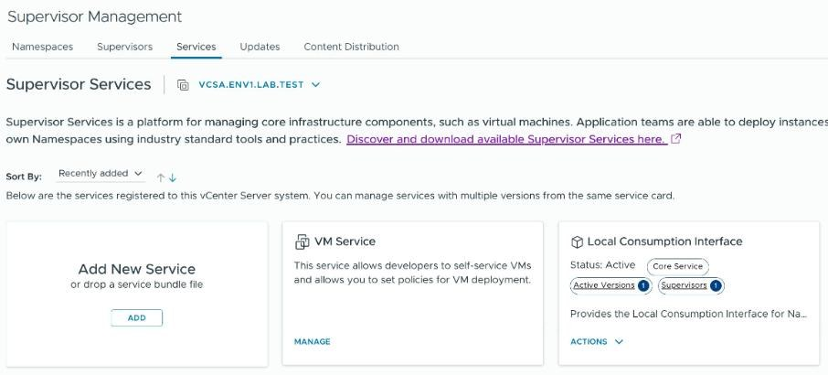

3. In the **New Service** window click **UPLOAD** and choose the manifest from step 1. The window
   then shows *YAML was uploaded successfully* and the service's details: name **ArgoCD
   Service**, ID `argocd-service.vsphere.vmware.com`, version `1.2.0-25642124`.

   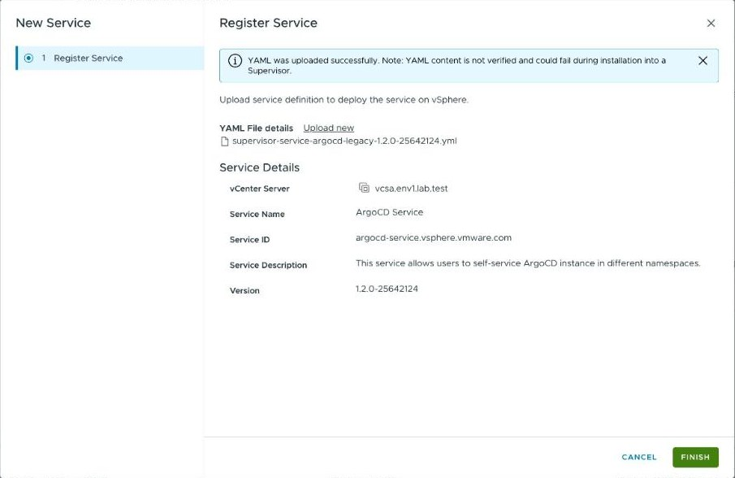

4. Click **FINISH**.

**Expect:** a green line, *Service 'ArgoCD Service' is successfully registered. You can now
install the service on Supervisors.*, and a new **ArgoCD Service** card showing **Active
Versions 1** and **Supervisors 0**.

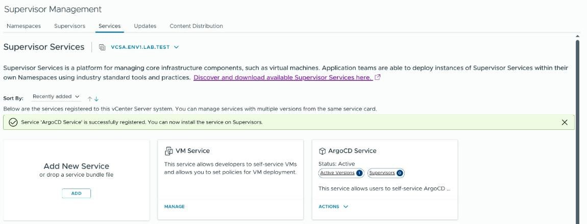

**If not:** the **ADD** button is missing or the upload is refused — your user lacks **Manage
Supervisor Services**. An error naming the YAML — you chose the wrong file; do not edit the
manifest.

## 3. Install the service on your Supervisor

1. On the **ArgoCD Service** card click **ACTIONS**, then **Manage Service**.

   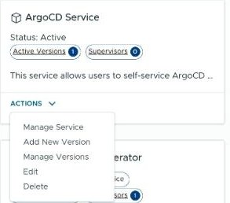

2. **Configure:** leave **Install Version** at `1.2.0-25642124`, select your Supervisor in the
   list, click **NEXT**.

   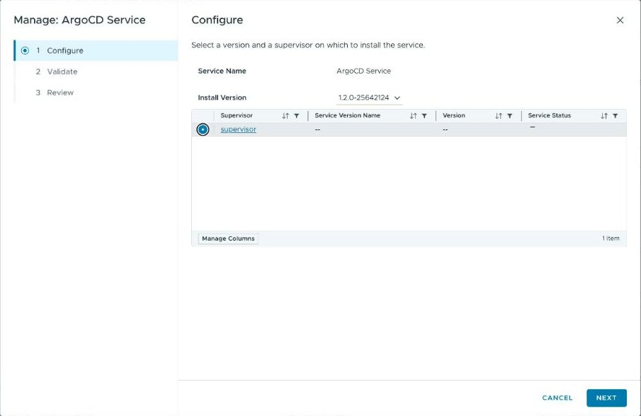

3. **Validate:** wait for *Validation completed successfully*, with **Compatibility Check** and
   **Signature Verification** both **Pass**. Click **NEXT**.

   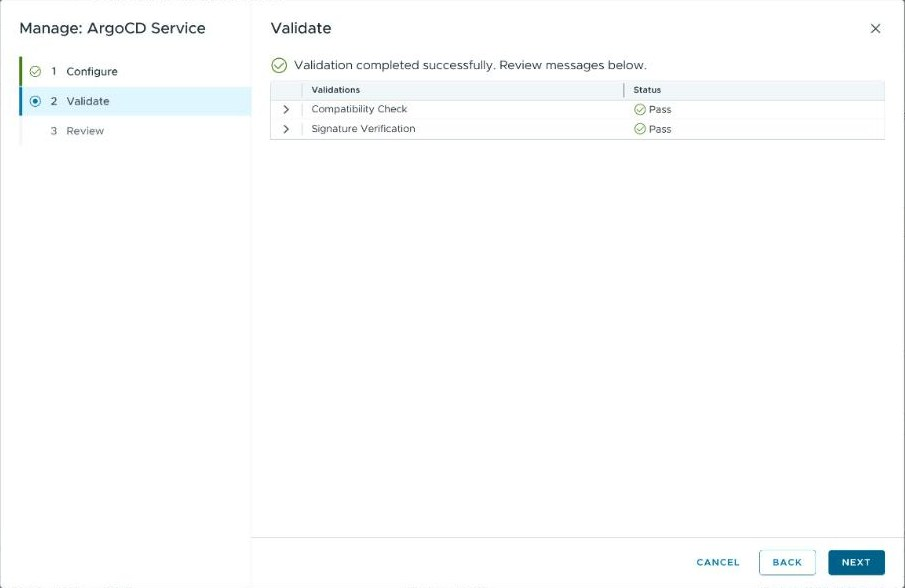

4. **Review:** leave **YAML Service Config (optional)** empty. Click **FINISH**.

   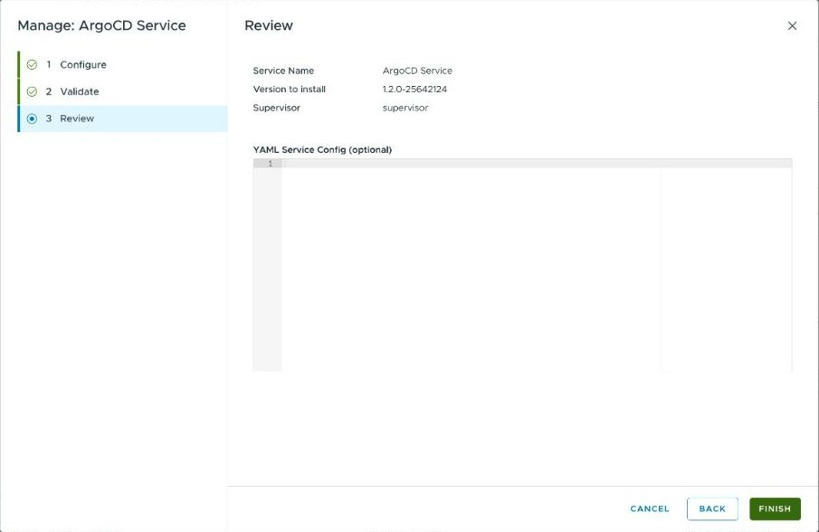

5. Open the **Supervisors** tab, and in your Supervisor's row click **View** in the **Services**
   column. (The same page is under your Supervisor → **Configure** → **Supervisor Services** →
   **Overview**.) Wait until the **ArgoCD Service** row shows **Configured**: about a minute.
   The refresh arrow at the top of the page reloads the list.

**Expect:** **ArgoCD Service**, status **Configured**, version `1.2.0-25642124`, signature
**Trusted**.

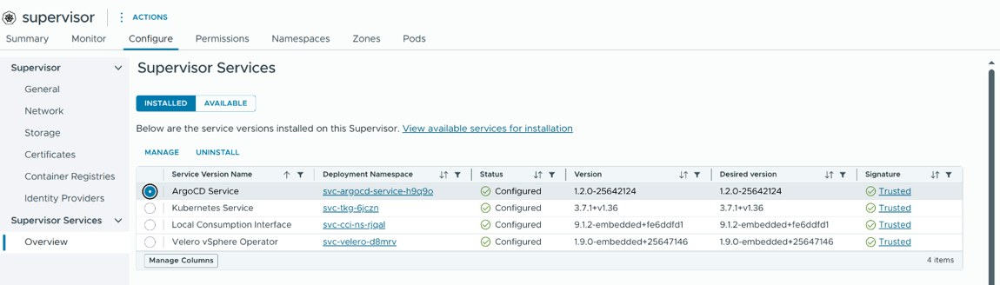

**If not:** a failed check in **Validate** — the message beside it says why; an error must be
fixed, a warning can be accepted. An error right after **FINISH** — wait a minute and do this
step again. A status that stays **Configuring** for more than 10 minutes, or shows an error — the
Supervisor cannot reach `projects.packages.broadcom.com`: tell your administrator.

## 4. Create the ArgoCD instance

The service only makes ArgoCD *available*. An instance — the ArgoCD you log in to — is one small
object in your vSphere Namespace. From here on your **Edit** role is enough, and the commands run
in a terminal on the machine where you did the main guide's steps.

First list the ArgoCD versions the service offers:

```sh
source ~/.vks-golang-web.env
kubectl --kubeconfig "$SUPERVISOR_KUBECONFIG" get argocdversion argocd-supported-versions -o jsonpath='{range .spec.versions[*]}{.version}{"  "}{.description}{"\n"}{end}'
```

**Expect:** a few lines such as `3.4.4+vmware.1-vks.1  Recommended version.`

**If not:** `the server doesn't have a resource type "argocdversion"` — step 3 has not finished.
`Unauthorized` — log in again (see *Gather what you need*).

Create the instance. If the first line of your list is not `3.4.4+vmware.1-vks.1`, replace that
version in the block with one your list marks *Recommended*.

```sh
source ~/.vks-golang-web.env
kubectl --kubeconfig "$SUPERVISOR_KUBECONFIG" -n "$VKS_NAMESPACE" apply -f - <<'EOF'
apiVersion: argocd-service.vsphere.vmware.com/v1alpha1
kind: ArgoCD
metadata:
  name: argocd-1
spec:
  version: "3.4.4+vmware.1-vks.1"
EOF
```

**Expect:** `argocd.argocd-service.vsphere.vmware.com/argocd-1 created`.

Check it. Run this again every half minute until it shows `Ready` and an address: one to two
minutes.

```sh
source ~/.vks-golang-web.env
kubectl --kubeconfig "$SUPERVISOR_KUBECONFIG" -n "$VKS_NAMESPACE" get argocd argocd-1 -o jsonpath='{.status.phase}{"  https://"}{.status.externalIP}{"\n"}'
```

**Expect:** `Ready  https://<an address>`. That address is ArgoCD's web page.

**If not:** `Forbidden` — the **Edit** role is missing. Still not `Ready` after 10 minutes —
`kubectl --kubeconfig "$SUPERVISOR_KUBECONFIG" -n "$VKS_NAMESPACE" describe argocd argocd-1` shows
why; an empty address means the Supervisor has no free load-balancer address.

## 5. Log in to the ArgoCD web page

ArgoCD made its own certificate, so your browser will warn about it and cannot check it for you.
Check it yourself before you type the password. Print the certificate's fingerprint and the admin
password:

```sh
source ~/.vks-golang-web.env
kubectl --kubeconfig "$SUPERVISOR_KUBECONFIG" -n "$VKS_NAMESPACE" get secret argocd-secret -o jsonpath='{.data.tls\.crt}' | base64 -d | openssl x509 -noout -fingerprint -sha256
kubectl --kubeconfig "$SUPERVISOR_KUBECONFIG" -n "$VKS_NAMESPACE" get secret argocd-initial-admin-secret -o jsonpath='{.data.password}' | base64 -d; echo
```

**Expect:** `sha256 Fingerprint=…` (`SHA256 Fingerprint=` on macOS), then the password on a line
of its own. Anyone who can read your screen can now log in: clear the terminal afterwards.

1. Open `https://<the address from step 4>` in your browser. It shows a warning such as *Your
   connection is not private*.
2. Open the certificate the page presents (in Chrome: **Not secure** in the address bar →
   **Certificate details**) and find its **SHA-256 fingerprint**. Compare its hex digits with
   the fingerprint printed above, ignoring colons, spaces and upper/lower case.
3. Only if they are the same: go on to the page (in Chrome: **Advanced** → **Proceed to …**) and
   log in with user name `admin` and the printed password.

**Expect:** the **Applications** page, with *No applications available to you just yet*.

**If not:** different fingerprints — something between you and ArgoCD replaces certificates (a
company proxy), or the address belongs to another server: do not type the password.
`secrets "argocd-initial-admin-secret" not found` — someone changed the admin password and
removed the first one: ask them for it.

Do not change the password under **User Info** if you also use
[ARGOCD-auto.md](ARGOCD-auto.md): its login helper reads the first password.

## 6. Let ArgoCD manage your vSphere Namespace

ArgoCD starts with no destination. This step makes your vSphere Namespace one.

**Read this first.** The first command gives ArgoCD's own account (`argocd-k8s-sa`) the **Edit**
role on your vSphere Namespace. Whoever can log in to this ArgoCD as `admin` can then, through
it, do everything Edit allows there: create and delete guest clusters and virtual machines, and
read secrets, including the kubeconfig of every guest cluster in the namespace. Share the ArgoCD
admin login only with people who may do that.

```sh
source ~/.vks-golang-web.env
kubectl --kubeconfig "$SUPERVISOR_KUBECONFIG" -n "$VKS_NAMESPACE" create rolebinding argocd-k8s-sa-edit --clusterrole=edit --serviceaccount="${VKS_NAMESPACE}:argocd-k8s-sa"
```

**Expect:** `rolebinding.rbac.authorization.k8s.io/argocd-k8s-sa-edit created`. `… already exists`
on a second run is fine.

Register the namespace with ArgoCD:

```sh
source ~/.vks-golang-web.env
kubectl --kubeconfig "$SUPERVISOR_KUBECONFIG" -n "$VKS_NAMESPACE" apply -f - <<EOF
apiVersion: argocd-service.vsphere.vmware.com/v1alpha1
kind: ManagedEntity
metadata:
  name: ${VKS_NAMESPACE}
spec:
  targetRef:
    apiGroup: ""
    kind: Namespace
    name: ${VKS_NAMESPACE}
EOF
```

**Expect:** `managedentity…/<your namespace> created`. In the ArgoCD page, **Settings** →
**Clusters** now lists your namespace, with the address
`https://kubernetes.default.svc/?context=<your namespace>`. Its status reads **Unknown** until an
Application uses it.

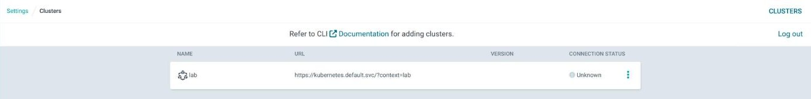

**If not:** the list stays empty —
`kubectl --kubeconfig "$SUPERVISOR_KUBECONFIG" -n "$VKS_NAMESPACE" describe managedentity "$VKS_NAMESPACE"`
names the failed condition (`MissingRoleBinding` means the first command failed).

Now create a project that limits what an Application may do: only this guide's Git repository,
only your vSphere Namespace, and only one kind of object — a guest cluster.

```sh
source ~/.vks-golang-web.env
kubectl --kubeconfig "$SUPERVISOR_KUBECONFIG" -n "$VKS_NAMESPACE" apply -f - <<EOF
apiVersion: argoproj.io/v1alpha1
kind: AppProject
metadata:
  name: vks-clusters
spec:
  description: Only VKS guest clusters, from one repository, into this vSphere Namespace
  sourceRepos:
  - https://github.com/AndriyKalashnykov/golang-web.git
  destinations:
  - name: ${VKS_NAMESPACE}
    namespace: ${VKS_NAMESPACE}
  namespaceResourceWhitelist:
  - group: cluster.x-k8s.io
    kind: Cluster
EOF
```

**Expect:** `appproject.argoproj.io/vks-clusters created`.

## 7. Create a guest cluster with ArgoCD

The cluster's description is a chart in this repository,
[`vks/argocd/guest-cluster`](argocd/guest-cluster). You give it four values; ArgoCD renders it
and applies the result to your vSphere Namespace, where VKS builds the cluster.

The Application below pins the chart to one commit of this repository
(`e236f5c43aa2a1c7a9cc84e7f3cbdbc7024942d6`), so a later change here cannot change your cluster.
For anything beyond trying this out, copy the `vks/argocd/guest-cluster` folder into a Git
repository of your own and use its address and commit in the Application and in step 6's
project: then only you decide what ArgoCD applies.

### Choose the cluster's values

List what you can choose from. Three commands, three lists:

```sh
source ~/.vks-golang-web.env
kubectl --kubeconfig "$SUPERVISOR_KUBECONFIG" get kr
```

```sh
source ~/.vks-golang-web.env
kubectl --kubeconfig "$SUPERVISOR_KUBECONFIG" -n "$VKS_NAMESPACE" get virtualmachineclass
```

```sh
source ~/.vks-golang-web.env
kubectl --kubeconfig "$SUPERVISOR_KUBECONFIG" get storageclass
```

**Expect:** Kubernetes releases, each with `READY` and `COMPATIBLE` columns; at least one VM
class with its CPU and memory; the Supervisor's storage classes.

Put your choices into this terminal. Keep using **this terminal** until the end of step 8.

- `NEW_CLUSTER`: a name no cluster in your namespace has. Start it with a letter.
- `K8S_VERSION`: the `VERSION` of a release whose `READY` and `COMPATIBLE` are both `True`,
  **without its `-vkr.N` ending**: for `v1.36.2+vmware.2-vkr.3` write `v1.36.2+vmware.2`. The
  Supervisor stores it that way; with the ending ArgoCD would report a difference forever.
- `VM_CLASS`: 2 CPUs and 4 GB is enough.
- `STORAGE_CLASS`: one your vSphere Namespace is allowed to use; your administrator knows which.

```sh
NEW_CLUSTER="my-new-cluster"
K8S_VERSION="v1.36.2+vmware.2"
VM_CLASS="best-effort-small"
STORAGE_CLASS="wcp-vmfs"
```

Check that no cluster has that name yet. ArgoCD would take over an existing cluster with the same
name, and step 9 would then delete it.

```sh
source ~/.vks-golang-web.env
kubectl --kubeconfig "$SUPERVISOR_KUBECONFIG" -n "$VKS_NAMESPACE" get cluster "$NEW_CLUSTER"
```

**Expect:** `Error from server (NotFound): clusters.cluster.x-k8s.io "<name>" not found`.

**If not:** a line describing a cluster — choose another `NEW_CLUSTER`.

### Create the Application

This prints the Application with your values filled in:

```sh
source ~/.vks-golang-web.env
cat <<EOF
apiVersion: argoproj.io/v1alpha1
kind: Application
metadata:
  name: ${NEW_CLUSTER}
spec:
  project: vks-clusters
  source:
    repoURL: https://github.com/AndriyKalashnykov/golang-web.git
    targetRevision: e236f5c43aa2a1c7a9cc84e7f3cbdbc7024942d6
    path: vks/argocd/guest-cluster
    helm:
      valuesObject:
        name: "${NEW_CLUSTER}"
        kubernetesVersion: "${K8S_VERSION}"
        vmClass: "${VM_CLASS}"
        storageClass: "${STORAGE_CLASS}"
        clusterClass: "builtin-generic-v3.7.0"
  destination:
    name: ${VKS_NAMESPACE}
    namespace: ${VKS_NAMESPACE}
EOF
```

**Expect:** 20 lines, from `apiVersion:` to the second `namespace:`, with your names in them and
no empty `""`.

1. In the ArgoCD page click **+ NEW APP**, then **EDIT AS YAML** (top right).
2. Select everything in the editor, delete it, and paste the 20 lines.

   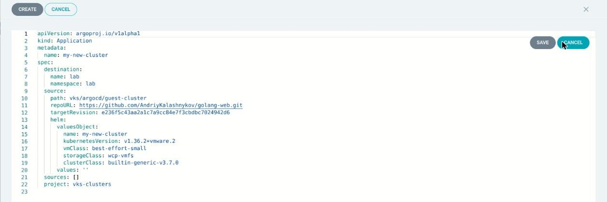

3. Click **SAVE**, then **CREATE** (top left). Leave **SYNC POLICY** at **Manual**.

**Expect:** a tile named after your cluster, with status **Missing** and **OutOfSync**: ArgoCD
knows what to create and has not created it yet.

**If not:** `application destination … is not permitted in project` — step 6's project was not
created. `repository not accessible` — the Supervisor cannot reach GitHub. `builtin-generic-v3.7.0`
is not offered by your Supervisor — replace it in the YAML with the newest name
`kubectl --kubeconfig "$SUPERVISOR_KUBECONFIG" -n vmware-system-vks-public get clusterclass` lists.

### Look at what it will do, then sync

1. Click the tile, then **DIFF**. The right half lists, in green, the `Cluster` object ArgoCD
   will create, with your name, version, VM class and storage class. The left half is empty:
   nothing exists yet.

   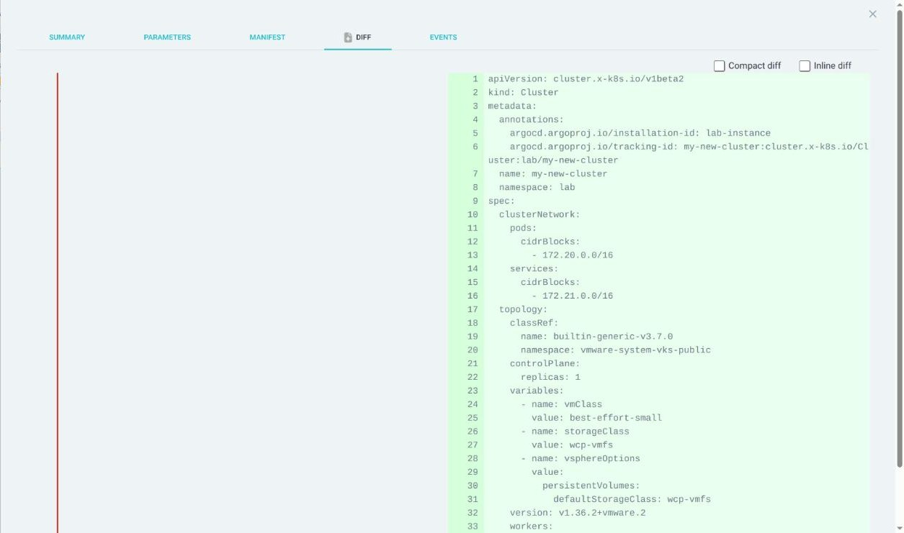

2. Close the view (✕, top right), click **SYNC**, then **SYNCHRONIZE**. Leave every box as it is.

   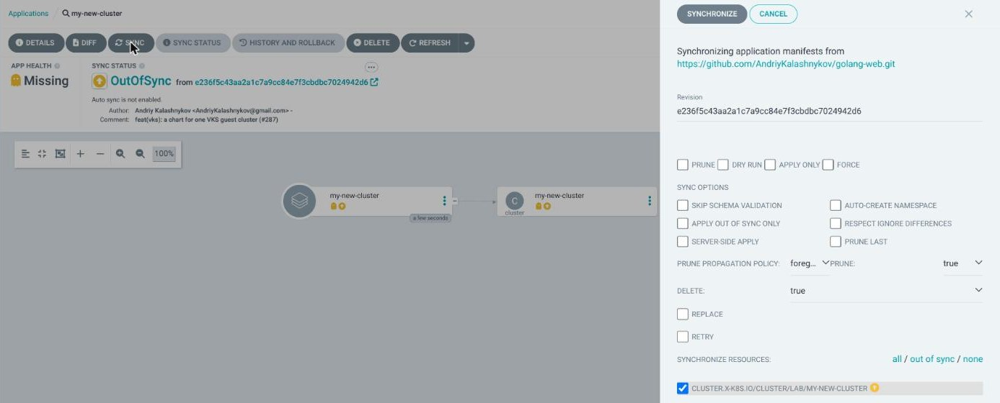

3. Wait. The page shows **Synced** at once and **Progressing** while VKS builds the cluster: 4
   to 7 minutes on the test system, longer on a busy one.

**Expect:** **Healthy**, **Synced** and **Sync OK**.

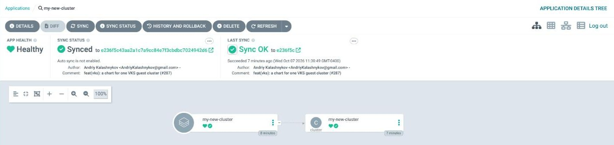

The vSphere Client shows the same cluster: **Supervisor Management** → **Namespaces** → your
namespace → **Resources** → **Kubernetes service**.

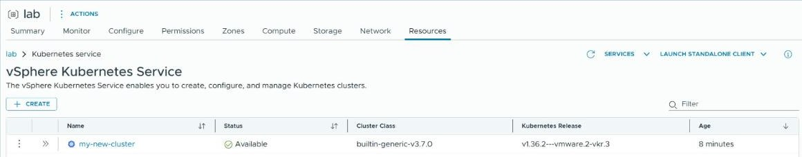

**If not:** red text in the DIFF, or a left half that is not empty, on a first sync — a cluster
with that name already exists: do not sync; delete the Application with **Non-cascading** (step
9 shows the window) and choose another name. Still **Progressing** after 30 minutes —
`kubectl --kubeconfig "$SUPERVISOR_KUBECONFIG" -n "$VKS_NAMESPACE" describe cluster "$NEW_CLUSTER"`
shows the condition that is waiting; a VM class that is too small, or a namespace without room,
shows there.

To use the new cluster, set `VKS_CLUSTER` in `~/.vks-golang-web.env` to its name and run the main
guide's step 7 from *Get the guest cluster's kubeconfig*.

ArgoCD applies this cluster only when you click **SYNC**. To change it later, open the
Application's **DETAILS** → **PARAMETERS**, edit a value, and sync again.

## 8. Add the new cluster to ArgoCD

This makes the guest cluster a destination too, so ArgoCD can deploy applications into it. The
**Edit** role from step 6 already covers it.

```sh
source ~/.vks-golang-web.env
kubectl --kubeconfig "$SUPERVISOR_KUBECONFIG" -n "$VKS_NAMESPACE" apply -f - <<EOF
apiVersion: argocd-service.vsphere.vmware.com/v1alpha1
kind: ManagedEntity
metadata:
  name: ${NEW_CLUSTER}
spec:
  targetRef:
    apiGroup: cluster.x-k8s.io
    kind: Cluster
    name: ${NEW_CLUSTER}
    namespace: ${VKS_NAMESPACE}
EOF
```

**Expect:** `managedentity…/<name> created`. In the ArgoCD page, **Settings** → **Clusters** now
lists two destinations: your namespace, and `<cluster>-<namespace>` at
`https://<an address>:6443`. The new one reads **Unknown** until an Application uses it.

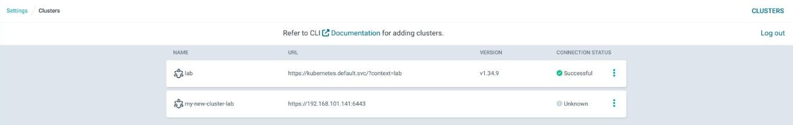

**If not:** `metadata.name: Required value` — this is not the terminal where you set
`NEW_CLUSTER` in step 7: set it again and run the block again.

The service keeps this destination's login in a secret it owns. That login is the cluster's own
client certificate; whether the service renews it before it expires was not tested for this
guide.

## 9. Clean up (optional)

Do these in order. ArgoCD must still exist while it deletes the cluster, and the service must
still exist while the instance is deleted.

### Delete the guest cluster

First remove the cluster from ArgoCD's destinations. Set `NEW_CLUSTER` again if this is a new
terminal.

```sh
source ~/.vks-golang-web.env
kubectl --kubeconfig "$SUPERVISOR_KUBECONFIG" -n "$VKS_NAMESPACE" delete managedentity "$NEW_CLUSTER"
```

**Expect:** `managedentity… "<name>" deleted`.

Then, in the ArgoCD page, open the Application, click **DELETE**, type the Application's name,
leave **Foreground** selected, and click **OK**. **Non-cascading** would remove only the
Application and leave the cluster and its virtual machines running.

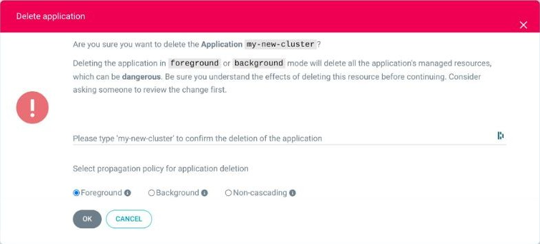

Check that the cluster is gone before you go on. Run this again until it prints nothing: a few
minutes at most.

```sh
source ~/.vks-golang-web.env
kubectl --kubeconfig "$SUPERVISOR_KUBECONFIG" -n "$VKS_NAMESPACE" get cluster,applications.argoproj.io
```

**Expect:** `No resources found in <your namespace> namespace.`

### Delete the ArgoCD instance

Skip this if the instance existed before you started this guide. It removes the project, the
destination, the role binding and the instance, then the two secrets the instance leaves behind
(a new instance would otherwise meet the old admin password).

```sh
source ~/.vks-golang-web.env
kubectl --kubeconfig "$SUPERVISOR_KUBECONFIG" -n "$VKS_NAMESPACE" delete appproject vks-clusters --ignore-not-found
kubectl --kubeconfig "$SUPERVISOR_KUBECONFIG" -n "$VKS_NAMESPACE" delete managedentity "$VKS_NAMESPACE" --ignore-not-found
kubectl --kubeconfig "$SUPERVISOR_KUBECONFIG" -n "$VKS_NAMESPACE" delete rolebinding argocd-k8s-sa-edit --ignore-not-found
kubectl --kubeconfig "$SUPERVISOR_KUBECONFIG" -n "$VKS_NAMESPACE" delete argocd argocd-1 --ignore-not-found
kubectl --kubeconfig "$SUPERVISOR_KUBECONFIG" -n "$VKS_NAMESPACE" delete secret argocd-initial-admin-secret argocd-redis --ignore-not-found
```

**Expect:** up to six `deleted` lines.

### Remove the ArgoCD Service

Only for the user who did steps 2 and 3, and only if those steps installed the service (not if it
was there before). First make sure no vSphere Namespace on this Supervisor still has an ArgoCD
instance: uninstalling removes them.

```sh
source ~/.vks-golang-web.env
kubectl --kubeconfig "$SUPERVISOR_KUBECONFIG" get argocd -A
```

**Expect:** `No resources found`.

**If not:** a list of instances — do not go on until their owners have deleted them. `Forbidden`
— you cannot see other namespaces: ask your vCenter administrator to check.

1. In the vSphere Client: **Supervisor Management** → **Supervisors** → **View** in your
   Supervisor's **Services** column. Select **ArgoCD Service** and click **UNINSTALL**, then
   **UNINSTALL** in the window that asks *Are you sure…*. The row shows **Removing**, then
   disappears: under a minute.
2. Only if no other Supervisor of this vCenter uses the service: open the **Services** tab, and
   on the **ArgoCD Service** card click **ACTIONS** → **Delete**. In the **Delete ArgoCD
   Service** window click **CONFIRM** under *1. Deactivate service*, then **CONFIRM** under
   *3. Delete all versions of the Service*, then **DELETE**. This removes the service from
   vCenter, for every Supervisor.

   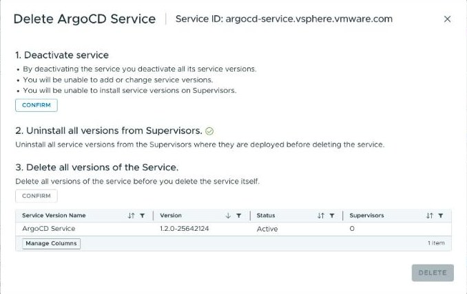

**Expect:** a green line, *'ArgoCD Service' successfully deleted.* The card disappears when the
page is reloaded.

## Fix common problems

| symptom | fix |
|---|---|
| `error: You must be logged in to the server (Unauthorized)` | Your Supervisor login ended (it lasts about 10 hours). Run the main guide's *Delete the Supervisor login* block (step 10), then its *Log in to the Supervisor* block (step 7), then the command again. |
| `error: stat …supervisor.kubeconfig: no such file or directory`, or an empty `--kubeconfig` error | The block's first line did not run, or the main guide's step 7 was never done on this machine. |
| The browser refuses the ArgoCD page with no way to go on | Some company browsers forbid pages with a certificate they cannot check. Use [ARGOCD-auto.md](ARGOCD-auto.md), which needs no browser. |
| The Application shows **OutOfSync** right after a sync | `kubernetesVersion` has a `-vkr.N` ending. Open the Application's **DETAILS** → **PARAMETERS**, remove the ending, save, and sync again. |
| The DIFF of an existing cluster lists a few lines only on the left | Two settings the Supervisor added to the cluster (certificate rotation and the network add-on). ArgoCD still reports **Synced**, and a sync leaves them in place. |
| The Application stays on **Deleting** for many minutes | Normal with **Foreground**: VKS deletes the virtual machines first. |
| **UNINSTALL** is refused, or instances disappear | An ArgoCD instance still existed on the Supervisor. `kubectl --kubeconfig "$SUPERVISOR_KUBECONFIG" get argocd -A` lists them; delete each (step 9) first. |
